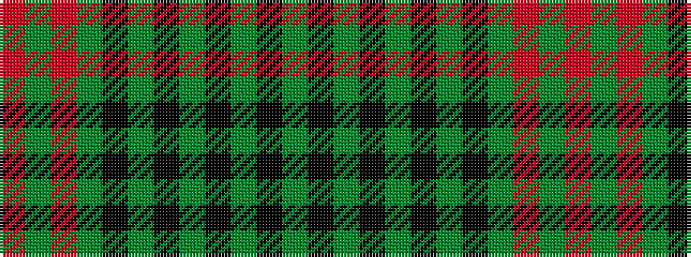

GKGKGKGKGRGR

It is a 12 stripe tartan.

<figure class="pat-woven">

<figcaption>idealised sample</figcaption>
</figure>

## Colour Sequence



## Tartans with this colour sequence

| Tartans |
|---------------|
| [Ross, Ryan (Personal)](/setts/s12/r3gi4r3gi4k4gi2k50gi2k4g3k4g3~x2/)|
||
