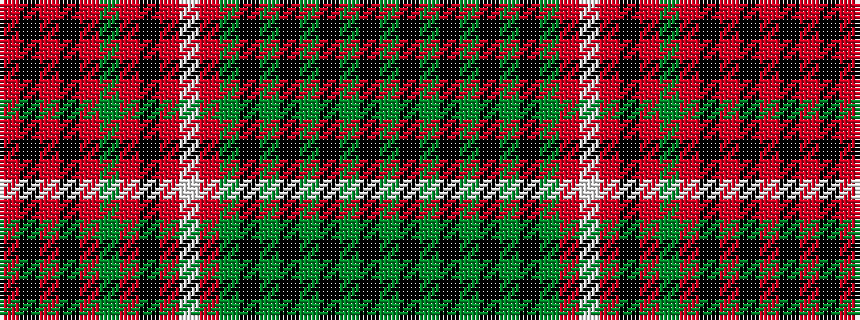

GKGKGKGKGRWRKRGRKRKR

It is a 20 stripe tartan.

<figure class="pat-woven">

<figcaption>idealised sample</figcaption>
</figure>

## Colour Sequence



## Tartans with this colour sequence

| Tartans |
|---------------|
| [Club World](/variants/s20/g14k7g21k2g2k2g2k4g7r25w2r2k3r16g9r2k4r2k4r2~x2/)|
||
