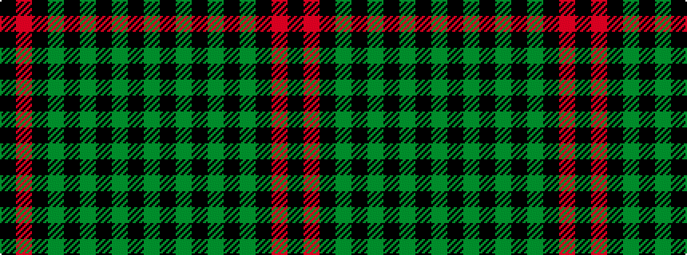

GKGKGKGKRK

It is a 10 stripe tartan.

<figure class="pat-woven">

<figcaption>idealised sample</figcaption>
</figure>

## Colour Sequence



## Tartans with this colour sequence

| Tartans |
|---------------|
| [Ulster (Peat) (District](/variants/s10/y28k2y28k2y2k2dy29k2r2k2~x2/)|
||
