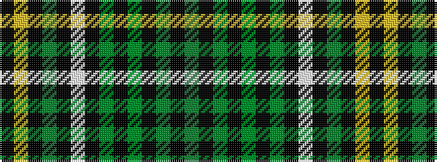

GKGKGKGKWKGKYK

It is a 14 stripe tartan.

<figure class="pat-woven">

<figcaption>idealised sample</figcaption>
</figure>

## Colour Sequence



## Tartans with this colour sequence

| Tartans |
|---------------|
| [MacAlpine](/setts/s14/k8ly1k4dg1k4w1k4dg1k1dg6k1dg6k1dg1~x4/)|
||
| [MacAlpine](/setts/s14/k4ly1k4g1k4w1k4g1k1g6k1g6k1g1~x4/)|
||
