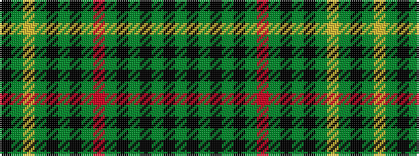

GKGKGKGRGKGKGYGK

It is a 16 stripe tartan.

<figure class="pat-woven">

<figcaption>idealised sample</figcaption>
</figure>

## Colour Sequence



## Tartans with this colour sequence

| Tartans |
|---------------|
| [Stewart hunting](/setts/s16/k3g10ly2g10k9g2k9g10r2g10k3g2k5g2k5g2~x2/)|
||
| [Stuart/Stewart Hunting #4](/setts/s16/k3dg10ly2dg10k9dg2k9dg10r2dg10k3dg2k5dg2k5dg2~x2/)|
||
