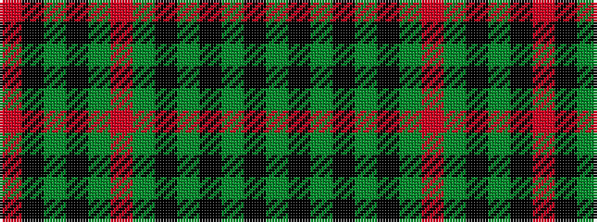

GKGKGKGRGKGKR

It is a 13 stripe tartan.

<figure class="pat-woven">

<figcaption>idealised sample</figcaption>
</figure>

## Colour Sequence



## Tartans with this colour sequence

| Tartans |
|---------------|
| [Moncrieffe (1998)](/setts/s13/g25k4g4k4g4k26g25r9g25k26g25k2r9~x2/)|
||
| [Moncrieffe Athol](/setts/s13/g20k3g3k3g3k18g21r4g21k18g19k2r4~x2/)|
||
