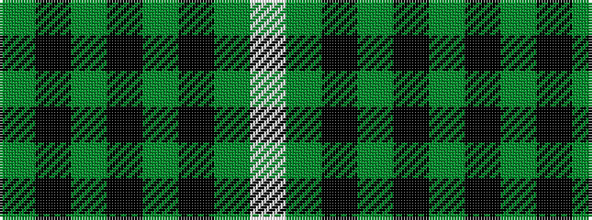

GKGKGKGW

It is a 8 stripe tartan.

<figure class="pat-woven">

<figcaption>idealised sample</figcaption>
</figure>

## Colour Sequence



## Tartans with this colour sequence

| Tartans |
|---------------|
| [Manor (Corporate)](/setts/s8/dg14k1dg2k1dg2k10g14lp2/)|
||
