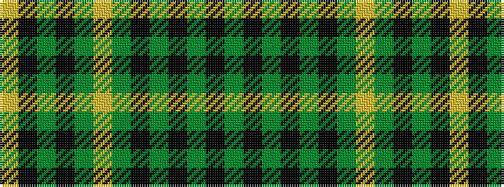

GKGKGKGYGKGKY

It is a 13 stripe tartan.

<figure class="pat-woven">

<figcaption>idealised sample</figcaption>
</figure>

## Colour Sequence



## Tartans with this colour sequence

| Tartans |
|---------------|
| [MacIsaac (Name?)](/variants/s13/yi20k2yi2k2yi2k20y20lo4y20k20yi20k1lo4~x2/)|
||
