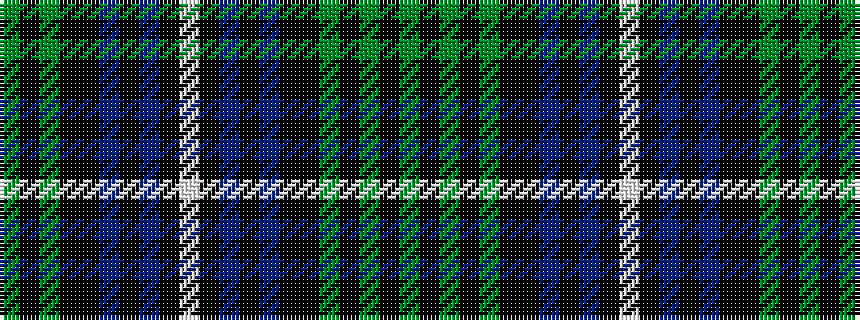

GKGKGKKBKBKWKBKBKKGKG

It is a 21 stripe tartan.

<figure class="pat-woven">

<figcaption>idealised sample</figcaption>
</figure>

## Colour Sequence



## Tartans with this colour sequence

| Tartans |
|---------------|
| [Dorris](/setts/s21/g24k3g3k3g3k18ki2t2ki2t2ki13w3ki13t2ki2t2ki2k18g19k4g4~x2/)|
||
