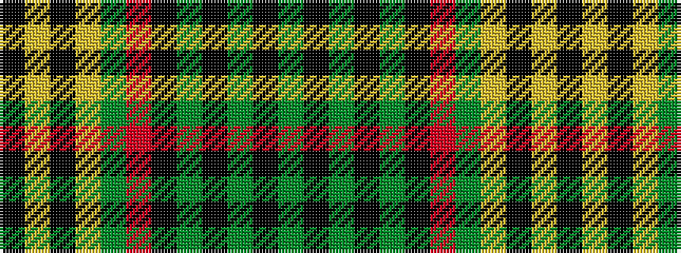

GKGKGKRGYKYK

It is a 12 stripe tartan.

<figure class="pat-woven">

<figcaption>idealised sample</figcaption>
</figure>

## Colour Sequence



## Tartans with this colour sequence

| Tartans |
|---------------|
| [MacMillan Ancient](/setts/dg2k1dg18k1dg2k1r12dg4ly6k1ly6k1/)|
||
| [MacMillan Old Clan Tartan](/variants/s12/g2k1g18k1g2k1m12g4ly6k1ly6k1~x2/)|
||
| [MacMillan, Ancient](/variants/s12/g2k1g18k1g2k1r12g4ly6k1ly6k1~x2/)|
||
