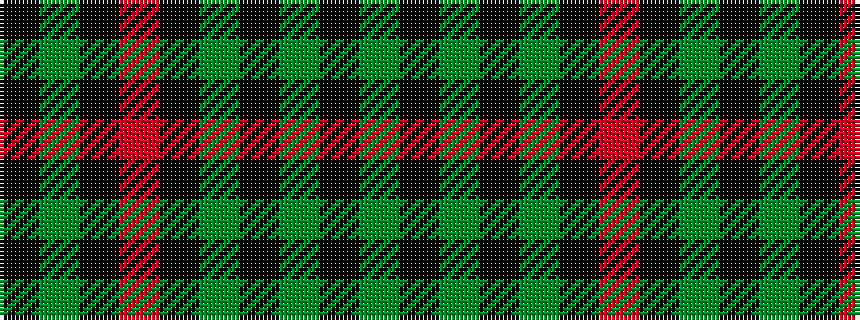

GKGKGKRKGK

It is a 10 stripe tartan.

<figure class="pat-woven">

<figcaption>idealised sample</figcaption>
</figure>

## Colour Sequence



## Tartans with this colour sequence

| Tartans |
|---------------|
| [Renwick](/setts/s10/k3g2k20r2k12g2k4g2k6g2~x2/)|
||
| [Tyndrum](/setts/s10/y6k1y1k1y2k4o6k1y2k2~x4/)|
||
