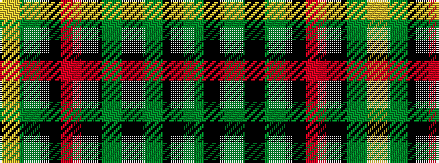

GKGKGKRKGY

It is a 10 stripe tartan.

<figure class="pat-woven">

<figcaption>idealised sample</figcaption>
</figure>

## Colour Sequence



## Tartans with this colour sequence

| Tartans |
|---------------|
| [Fitzsimmons](/variants/s10/y3k2dg18k4y15k4o6k4y2ly3~x2/)|
||
