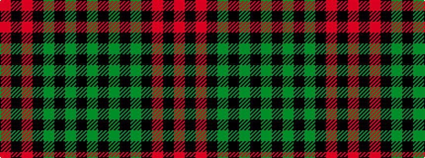

GKGKGKRKR

It is a 9 stripe tartan.

<figure class="pat-woven">

<figcaption>idealised sample</figcaption>
</figure>

## Colour Sequence



## Tartans with this colour sequence

| Tartans |
|---------------|
| [Alma College](/variants/s9/g24k3g2k3g4k4m20k3m6~x2/)|
||
| [Stewart of Athol](/variants/s9/g22k1g2k1g3k8r20k1r6~x2/)|
||
| [Stewart of Atholl](/variants/s9/dg22k1dg2k1dg3k8r20k1r6~x2/)|
||
| [Stewart of Atholl (Clan)](/variants/s9/dg22k1dg2k1dg3k8r20k1r3~x4/)|
||
