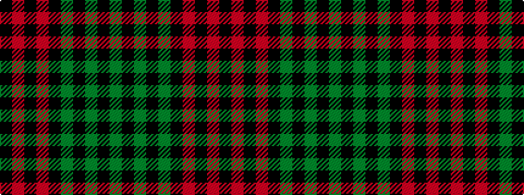

GKGKGKRKRK

It is a 10 stripe tartan.

<figure class="pat-woven">

<figcaption>idealised sample</figcaption>
</figure>

## Colour Sequence



## Tartans with this colour sequence

| Tartans |
|---------------|
| [Kerr](/variants/s10/dg20k1dg2k1dg3k14r28k1r2k4~x2/)|
||
| [Kerr](/variants/s10/g20k1g2k1g3k14r28k1r2k4~x2/)|
||
