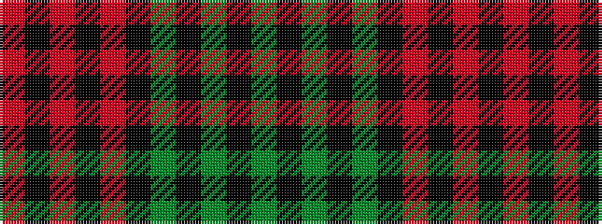

GKGKGKRKRKR

It is a 11 stripe tartan.

<figure class="pat-woven">

<figcaption>idealised sample</figcaption>
</figure>

## Colour Sequence



## Tartans with this colour sequence

| Tartans |
|---------------|
| [Aubigny, Auld Alliance](/variants/s11/y20k2y3k2y4k9r18k2r5k2r9~x2/)|
||
