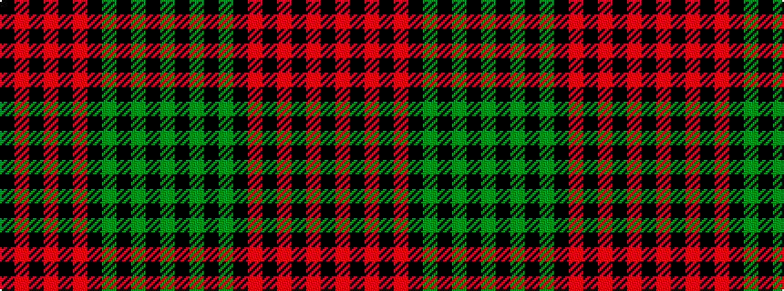

GKGKGKRKRKRK

It is a 12 stripe tartan.

<figure class="pat-woven">

<figcaption>idealised sample</figcaption>
</figure>

## Colour Sequence



## Tartans with this colour sequence

| Tartans |
|---------------|
| [Pope of Wales](/setts/s12/k10r26k2r4k2r26k3gi36k3g30k3y2/)|
||
