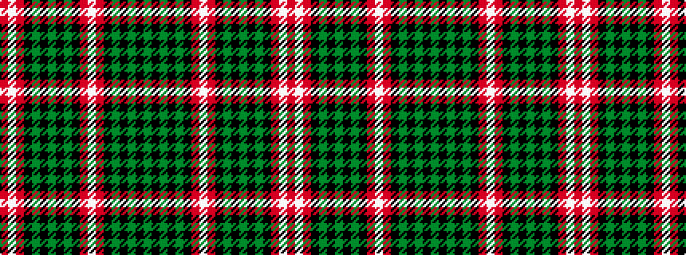

GKGKGKRWRKGKGKGKRWR

It is a 19 stripe tartan.

<figure class="pat-woven">

<figcaption>idealised sample</figcaption>
</figure>

## Colour Sequence



## Tartans with this colour sequence

| Tartans |
|---------------|
| [Pride of Loch Leven (Fashion?)](/variants/s19/dg8k1dg1k1dg1k4m10w2m10k3dg3k6dg3k6dg3k3m10w3r4~x2/)|
||
