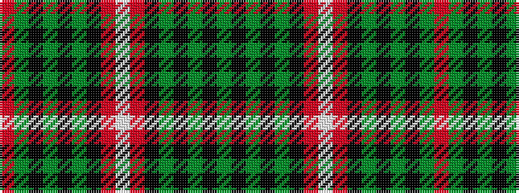

GKGKGKRWRKGKGKGR

It is a 16 stripe tartan.

<figure class="pat-woven">

<figcaption>idealised sample</figcaption>
</figure>

## Colour Sequence



## Tartans with this colour sequence

| Tartans |
|---------------|
| [Hunter of Bute (Personal)](/setts/s16/r12g6k6g2k1g1k6r24w2~x2/)|
||
