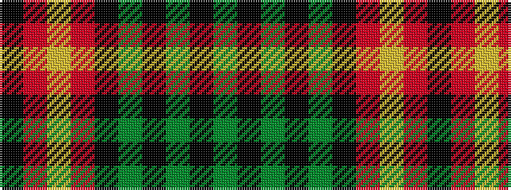

GKGKGKRYRK

It is a 10 stripe tartan.

<figure class="pat-woven">

<figcaption>idealised sample</figcaption>
</figure>

## Colour Sequence



## Tartans with this colour sequence

| Tartans |
|---------------|
| [Bomb Disposal](/variants/s10/ki28r3lo2r3ki13dg28k1dg3k1dg16~x2/)|
||
