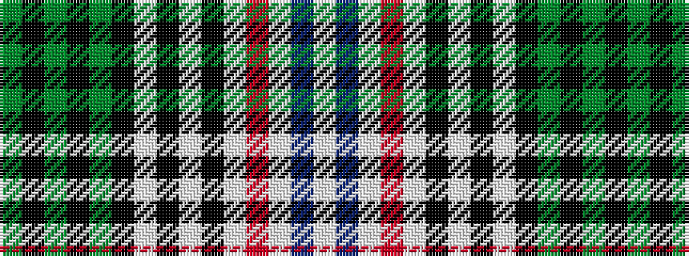

GKGKGKWKWKWRWBW

It is a 15 stripe tartan.

<figure class="pat-woven">

<figcaption>idealised sample</figcaption>
</figure>

## Colour Sequence



## Tartans with this colour sequence

| Tartans |
|---------------|
| [Prestoungrange/Dolphinstoun/Wills dress](/setts/s15/w3b2w3r4w16k2w2k2w3k10dg35k2dg2k1dg2~x2/)|
||
