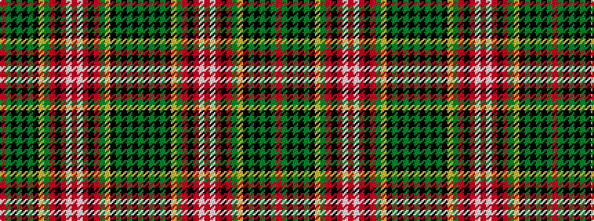

GKGKGKYGRKRWRWRKRGYKGKGKGR

It is a 26 stripe tartan.

<figure class="pat-woven">

<figcaption>idealised sample</figcaption>
</figure>

## Colour Sequence



## Tartans with this colour sequence

| Tartans |
|---------------|
| [Wilson's No.155](/variants/s26/r21y9k2y2k2y9k18ly3dg21r13k3r13w2r13~x2/)|
||
