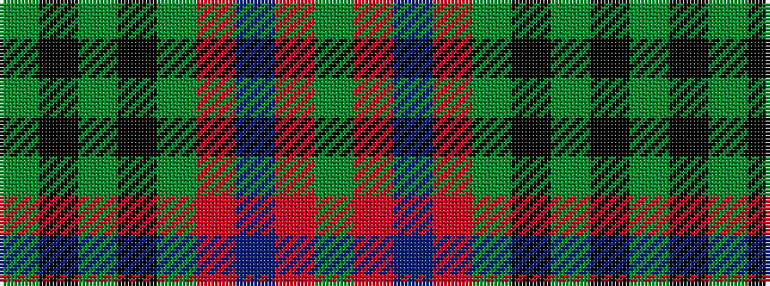

GKGKGRBRG

It is a 9 stripe tartan.

<figure class="pat-woven">

<figcaption>idealised sample</figcaption>
</figure>

## Colour Sequence



## Tartans with this colour sequence

| Tartans |
|---------------|
| [Somerset District Tartan](/variants/s9/g8o8t7r5dy2k2dy2k2dy2~x2/)|
||
