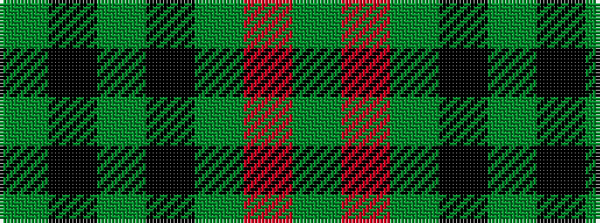

GKGKGRG

It is a 7 stripe tartan.

<figure class="pat-woven">

<figcaption>idealised sample</figcaption>
</figure>

## Colour Sequence



## Tartans with this colour sequence

| Tartans |
|---------------|
| [Korner-Macpherson (Personal)](/variants/s7/y5r3y35k28y4k11y2~x2/)|
||
