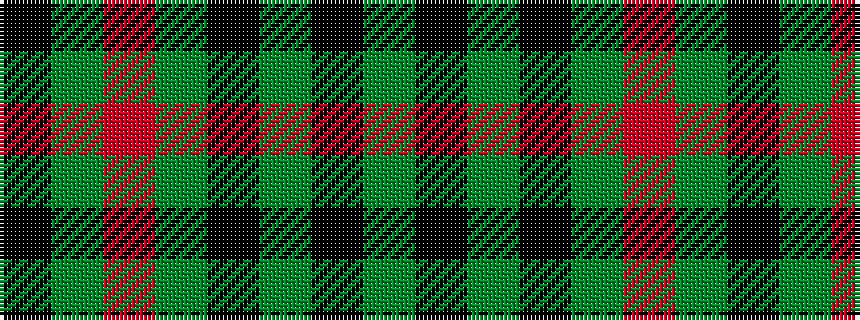

GKGKGRGK

It is a 8 stripe tartan.

<figure class="pat-woven">

<figcaption>idealised sample</figcaption>
</figure>

## Colour Sequence



## Tartans with this colour sequence

| Tartans |
|---------------|
| [Land's End](/variants/s8/k2g9m2g9k2g2k26dg2~x2/)|
||
