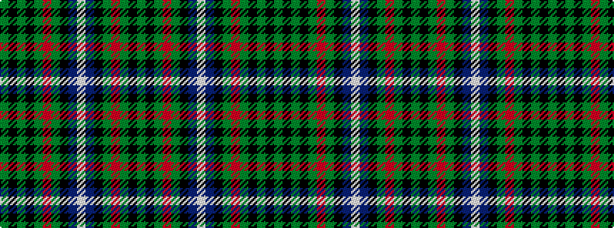

GKGKGRGKBWBKGRGKG

It is a 17 stripe tartan.

<figure class="pat-woven">

<figcaption>idealised sample</figcaption>
</figure>

## Colour Sequence



## Tartans with this colour sequence

| Tartans |
|---------------|
| [MacRae](/variants/s17/g12k3g12k3g12r2g3k1db3w1db3k1g3r2g12k3g12~x2/)|
||
| [MacRae](/variants/s17/dg24k3dg12r2dg3k1db3w1db3k1dg3r2dg12k3dg12k3dg12~x2/)|
||
