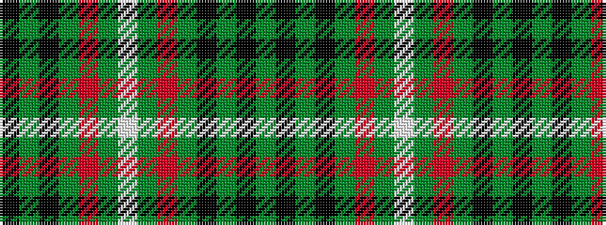

GKGKGRGWGRGKGK

It is a 14 stripe tartan.

<figure class="pat-woven">

<figcaption>idealised sample</figcaption>
</figure>

## Colour Sequence



## Tartans with this colour sequence

| Tartans |
|---------------|
| [O'Neill Clan/Family Tartan Tartan Number: 4135. Earliest known date: 1999 Designed by Linda Clifford, USA for a Timothy O'Neill but may be used by anyone of the name O'Neill and its variants. See products available Copyright © Blair Urquhart, Comrie, 2015](/setts/s14/lb6dg5r5dg45k4dy24k4dg5~x2/)|
||
