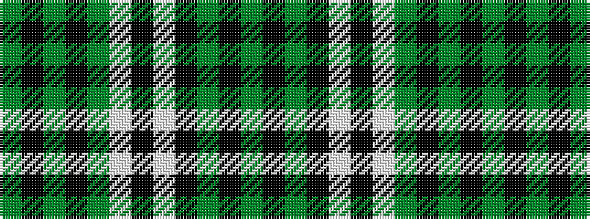

GKGKGWKWKGKG

It is a 12 stripe tartan.

<figure class="pat-woven">

<figcaption>idealised sample</figcaption>
</figure>

## Colour Sequence



## Tartans with this colour sequence

| Tartans |
|---------------|
| [Grey Watch](/setts/s12/y25k4y4k4y4w20k5w20k20y4k4y4~x2/)|
||
