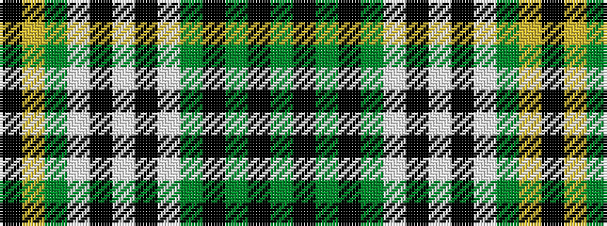

GKGKGWKWKWGYK

It is a 13 stripe tartan.

<figure class="pat-woven">

<figcaption>idealised sample</figcaption>
</figure>

## Colour Sequence



## Tartans with this colour sequence

| Tartans |
|---------------|
| [Lomond (1983)](/variants/s13/y30k2g2k2g2lb3k1lb2k1lb1g12lo2k6~x4/)|
||
