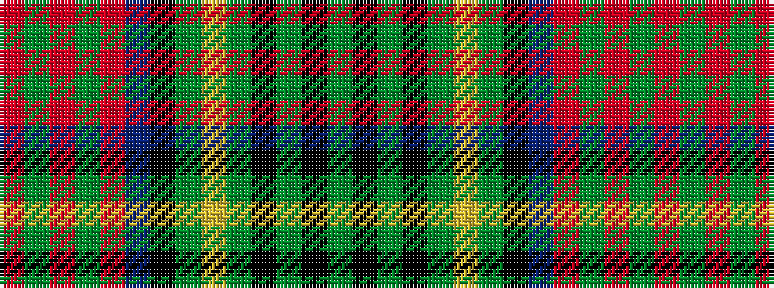

GKGKGYGKBRGRGR

It is a 14 stripe tartan.

<figure class="pat-woven">

<figcaption>idealised sample</figcaption>
</figure>

## Colour Sequence



## Tartans with this colour sequence

| Tartans |
|---------------|
| [Humble, Gordon (Personal)](/variants/s14/o4dy2o14dy4o4p1k8dg13ly3dg13k8dy10k3dy3~x2/)|
||
