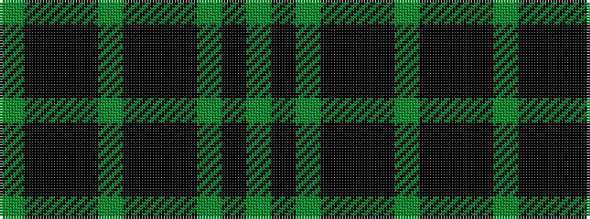

GKGKKKGKKKG

It is a 11 stripe tartan.

<figure class="pat-woven">

<figcaption>idealised sample</figcaption>
</figure>

## Colour Sequence



## Tartans with this colour sequence

| Tartans |
|---------------|
| [Laggen Dress (Fashion)](/setts/s11/y42k10y2k2k2k2y10k6k2k3y2~x2/)|
||
