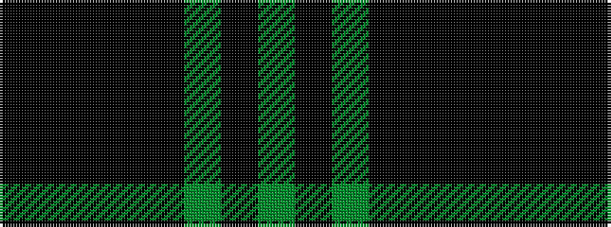

GKGKKKKK

It is a 8 stripe tartan.

<figure class="pat-woven">

<figcaption>idealised sample</figcaption>
</figure>

## Colour Sequence



## Tartans with this colour sequence

| Tartans |
|---------------|
| [Arundel County (District)](/setts/s8/k2k5k4k1k4g16k3g2~x4/)|
||
