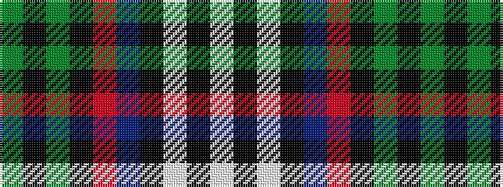

GKGKRBKWKW

It is a 10 stripe tartan.

<figure class="pat-woven">

<figcaption>idealised sample</figcaption>
</figure>

## Colour Sequence



## Tartans with this colour sequence

| Tartans |
|---------------|
| [Murray-Hetherington (Personal)](/setts/s10/g1k1g14k2r3db3k6w1k1w1~x4/)|
||
