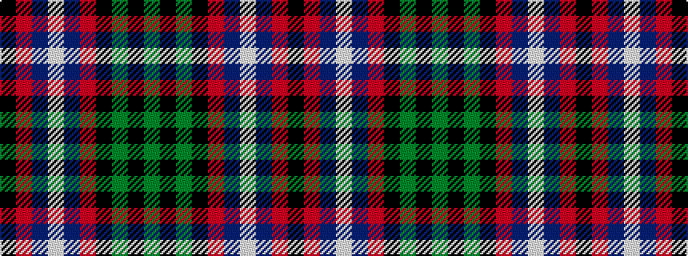

GKGKRBWBRK

It is a 10 stripe tartan.

<figure class="pat-woven">

<figcaption>idealised sample</figcaption>
</figure>

## Colour Sequence



## Tartans with this colour sequence

| Tartans |
|---------------|
| [Hunter](/variants/s10/k8r1db8lb1db8r1k8dg8k1dg8~x2/)|
||
| [Hunter](/variants/s10/k8r1db8w1db8r1k8g8k1g8~x2/)|
||
