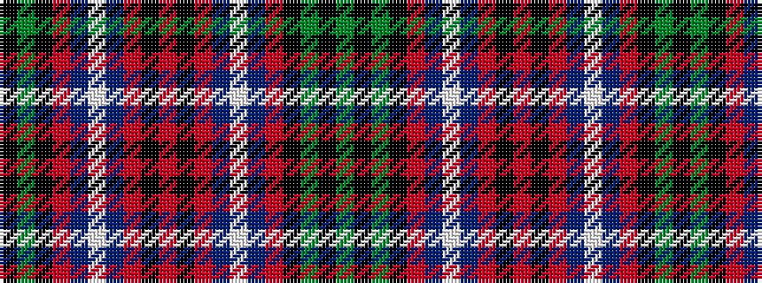

GKGKRBWBRKRKRBWBRKGK

It is a 20 stripe tartan.

<figure class="pat-woven">

<figcaption>idealised sample</figcaption>
</figure>

## Colour Sequence



## Tartans with this colour sequence

| Tartans |
|---------------|
| [Hunter of Peebleshire](/setts/s20/g8k1g8k8r1db8w1db8r1k8r1~x4/)|
||
