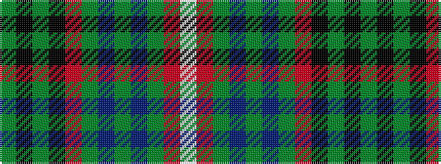

GKGKRGBGBGRW

It is a 12 stripe tartan.

<figure class="pat-woven">

<figcaption>idealised sample</figcaption>
</figure>

## Colour Sequence



## Tartans with this colour sequence

| Tartans |
|---------------|
| [Tweedbank](/variants/s12/w4ri8g1db4g1db4g1r25k25g2k1g2~x2/)|
||
