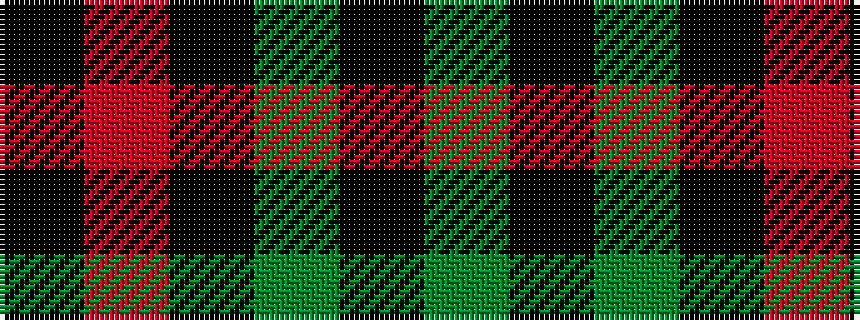

GKGKRK

It is a 6 stripe tartan.

<figure class="pat-woven">

<figcaption>idealised sample</figcaption>
</figure>

## Colour Sequence



## Tartans with this colour sequence

| Tartans |
|---------------|
| [Fife, Duke Of](/setts/s6/dg32k6dg4k8r1k2~x4/)|
||
| [Fife, Duke of..](/setts/s6/g32k6g4k8r1k2~x2/)|
||
