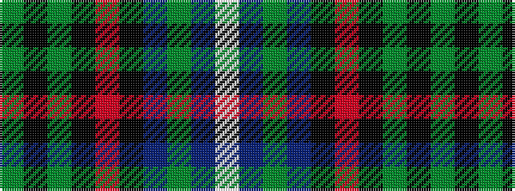

GKGKRKBGBW

It is a 10 stripe tartan.

<figure class="pat-woven">

<figcaption>idealised sample</figcaption>
</figure>

## Colour Sequence



## Tartans with this colour sequence

| Tartans |
|---------------|
| [Otago](/setts/s10/y16k2y6k2r2k2db15g1db1w2~x2/)|
||
