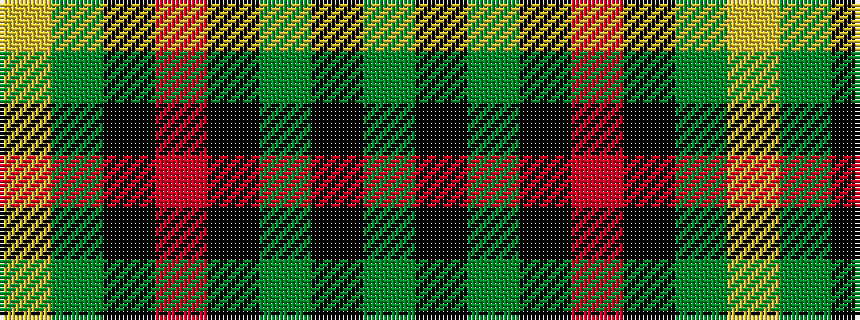

GKGKRKGY

It is a 8 stripe tartan.

<figure class="pat-woven">

<figcaption>idealised sample</figcaption>
</figure>

## Colour Sequence



## Tartans with this colour sequence

| Tartans |
|---------------|
| [Crane of Cluny (Personal)](/setts/s8/g82k6g3k9r2k5g2ly2~x2/)|
||
| [Stewart from Cairnie](/setts/s8/dg83k6dg3k9r2k5dg2ly2~x2/)|
||
