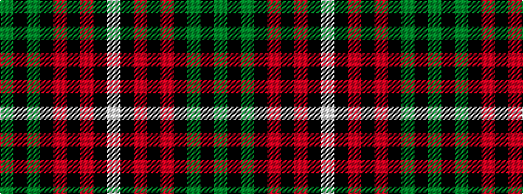

GKGKRKRKW

It is a 9 stripe tartan.

<figure class="pat-woven">

<figcaption>idealised sample</figcaption>
</figure>

## Colour Sequence



## Tartans with this colour sequence

| Tartans |
|---------------|
| [New Golf Club](/variants/s9/dg4k4dg23k11r2k2r2k20w4~x2/)|
||
