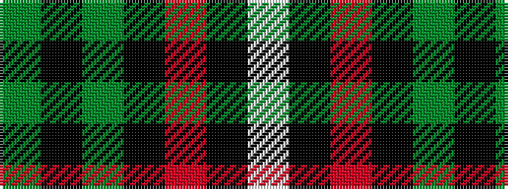

GKGKRKW

It is a 7 stripe tartan.

<figure class="pat-woven">

<figcaption>idealised sample</figcaption>
</figure>

## Colour Sequence



## Tartans with this colour sequence

| Tartans |
|---------------|
| [Page](/setts/s7/dg46k18dg6k13r4k4w4~x2/)|
||
