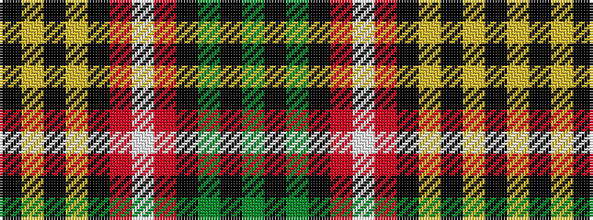

GKGKRWRKYKYK

It is a 12 stripe tartan.

<figure class="pat-woven">

<figcaption>idealised sample</figcaption>
</figure>

## Colour Sequence



## Tartans with this colour sequence

| Tartans |
|---------------|
| [Buchanan #7](/setts/s12/k18ly17k2ly17k9r17w2r17k9dg18k10dg18~x2/)|
||
| [Buchanan 6](/setts/s12/k18ly17k2ly17k9r17w2r17k9g18k10g18~x2/)|
||
