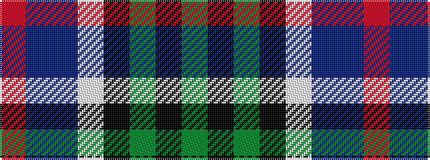

GKGKWBBR

It is a 8 stripe tartan.

<figure class="pat-woven">

<figcaption>idealised sample</figcaption>
</figure>

## Colour Sequence



## Tartans with this colour sequence

| Tartans |
|---------------|
| [Culloden Grey](/variants/s8/r6db3dp24w2k23y23k2y6~x2/)|
||
| [Culloden, Grey](/variants/s8/r6db3p24w2k23y23k2y6~x2/)|
||
