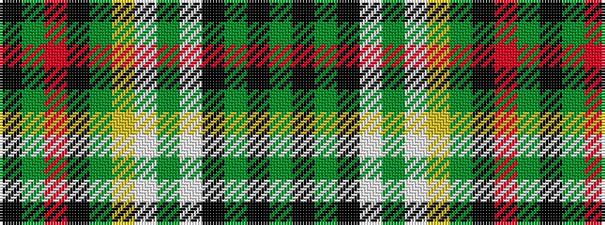

GKGKWGWYGKRGK

It is a 13 stripe tartan.

<figure class="pat-woven">

<figcaption>idealised sample</figcaption>
</figure>

## Colour Sequence



## Tartans with this colour sequence

| Tartans |
|---------------|
| [Savoy](/variants/s13/g16k8g1k1lb1g1lb1lo1g1k1o1g4k1~x4/)|
||
