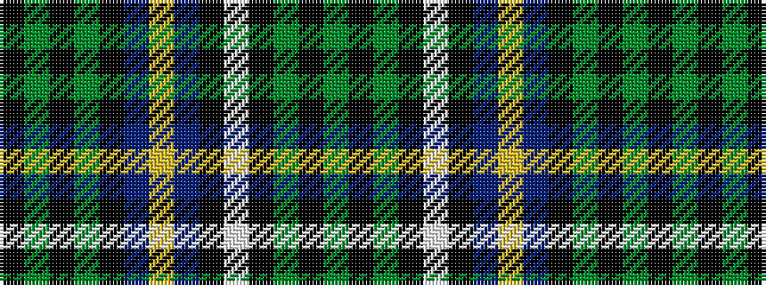

GKGKWKBYBKGKGK

It is a 14 stripe tartan.

<figure class="pat-woven">

<figcaption>idealised sample</figcaption>
</figure>

## Colour Sequence



## Tartans with this colour sequence

| Tartans |
|---------------|
| [Simon and Friends (Hamburg) (Persona](/setts/s14/k6dg5k6dg12k23do13ly6db13k12w2k23dg12k6dg5~x2/)|
||
| [Simon and Friends (Hamburg) (Personal)](/setts/s14/k6dg5k6dg12k23do13lo6do13k12w2k23dg12k6dg5~x2/)|
||
