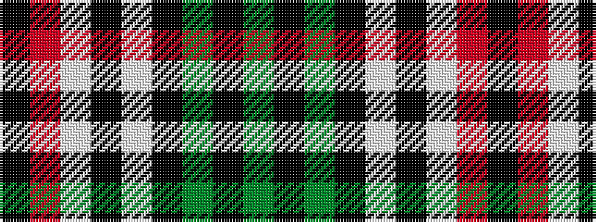

GKGKWKWRK

It is a 9 stripe tartan.

<figure class="pat-woven">

<figcaption>idealised sample</figcaption>
</figure>

## Colour Sequence



## Tartans with this colour sequence

| Tartans |
|---------------|
| [Aquascutum (Kinloch Anderson)](/variants/s9/dy7k7dy4k26w12k3w14m2k6/)|
||
