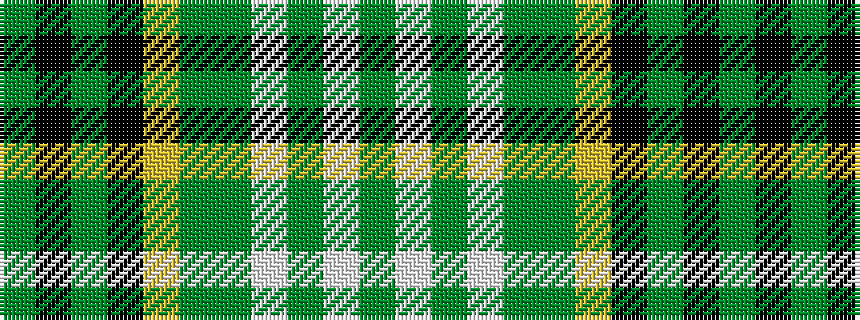

GKGKYGGWGWG

It is a 11 stripe tartan.

<figure class="pat-woven">

<figcaption>idealised sample</figcaption>
</figure>

## Colour Sequence



## Tartans with this colour sequence

| Tartans |
|---------------|
| [Parkhead](/setts/s11/gi1k1gi9k7ly1gi5g4w2g1w1gi1~x4/)|
||
