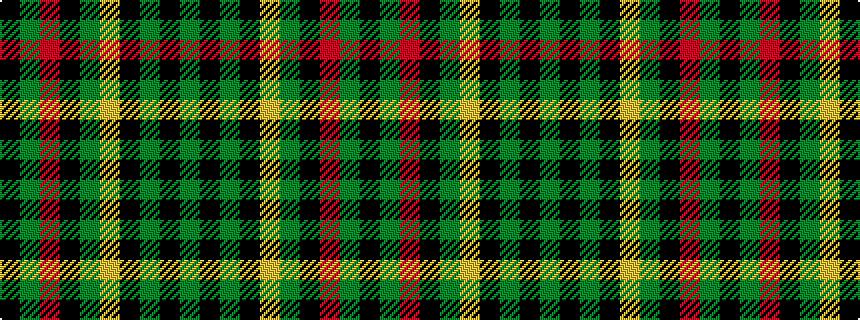

GKGKYGKRGK

It is a 10 stripe tartan.

<figure class="pat-woven">

<figcaption>idealised sample</figcaption>
</figure>

## Colour Sequence



## Tartans with this colour sequence

| Tartans |
|---------------|
| [Manitoba Cue Sports](/variants/s10/k8y4r1k2y16lo1k8y2k2y4~x4/)|
||
