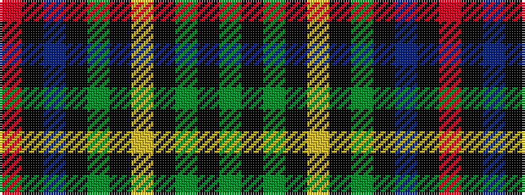

GKGKYKGKBKR

It is a 11 stripe tartan.

<figure class="pat-woven">

<figcaption>idealised sample</figcaption>
</figure>

## Colour Sequence



## Tartans with this colour sequence

| Tartans |
|---------------|
| [de Vere-Austin (Clan)](/setts/s11/dg14k8dg21k2lo5k2dg21k11db18k2r5~x2/)|
||
