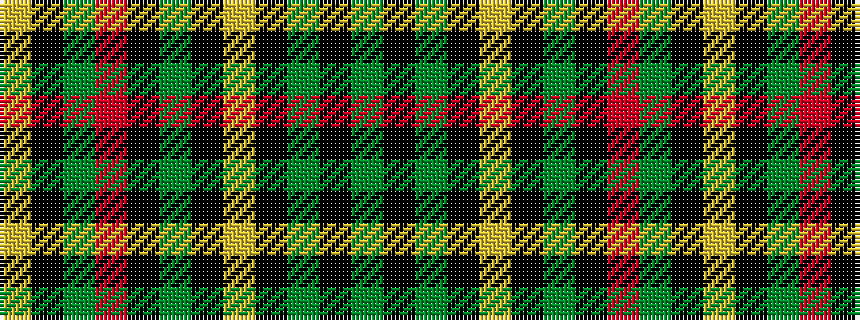

GKGKYKGKRGKY

It is a 12 stripe tartan.

<figure class="pat-woven">

<figcaption>idealised sample</figcaption>
</figure>

## Colour Sequence



## Tartans with this colour sequence

| Tartans |
|---------------|
| [Castlefield (Personal)](/variants/s12/lr3k15y10o10k1g5k1lo10k10g8k1y2~x2/)|
||
