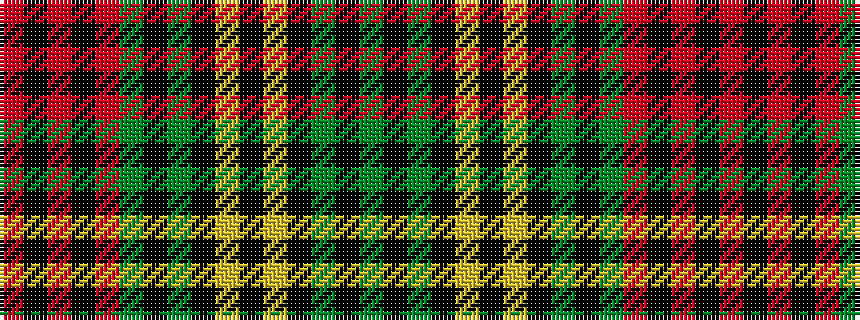

GKGKYKYKGKGRKRKR

It is a 16 stripe tartan.

<figure class="pat-woven">

<figcaption>idealised sample</figcaption>
</figure>

## Colour Sequence



## Tartans with this colour sequence

| Tartans |
|---------------|
| [MacMillan (1946)](/variants/s16/g22k2g5k2ly10k3ly10k2g5k2g22r8k2r8k2r8~x2/)|
||
